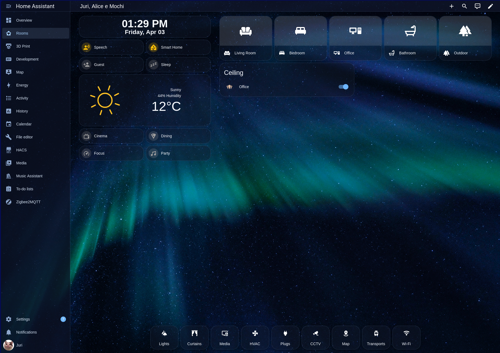
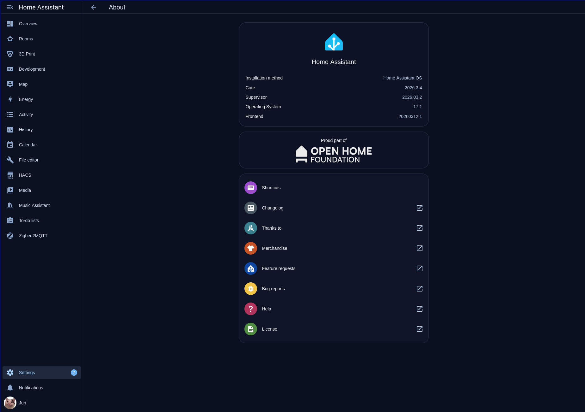
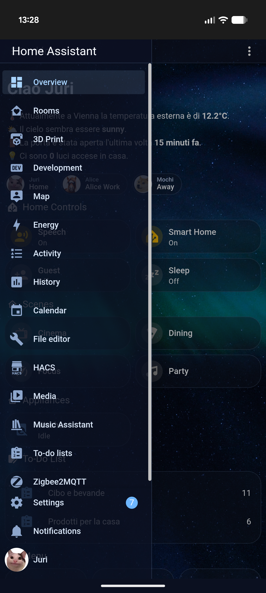

# Your Name.
Home Assistant theme - A dark, electric blue theme that reminds (me) the movie Your Name.   

* [Prerequisites](#prerequisites)
* [HACS installation](#hacs_installation)
* [Manual installation](#manual_installation)
* [Enable the theme](#enable_the_theme)
* [Background Image](#background_image)
* [Screenshots](#screenshots)

## Prerequisites
1. Edit **configuration.yaml** to allow loading themes from the themes folder:   

<pre>
frontend:
  themes: !include_dir_merge_named themes
</pre>

2. Create the folder **themes** next to the **configuration.yaml** file

## HACS installation
1. Open the Community Store (HACS)
2. Search for `Your Name.`
3. Install it
4. Restart Home Assistant

## Manual installation
1. Copy the file `yourname.yaml` into your Home Assistant `themes` folder
2. Create the folder `backgrounds` inside `www` and copy the background image `yourname.jpg` in it (www/backgrounds/yourname.jpg)
3. Restart Home Assistant

## Enable the theme
- Open your **Profile** in Home Assistant and select the theme called **yourname**

## Background image
- When installing with HACS the `backgrounds` folder is not created and with it also the background image is not copied. The theme looks for the background image which does not exist thus won't show it. If this happens, check the [Manual installation](#manual_installation) at step #2 and restart Home Assistant once again.

## Screenshots
- I switched to a different background image so don't mind the difference.

**Home overview**

  

**Settings - About**

  

**Mobile**

  

